## CS767 Assignment 1

I use all 4 late days. new deadline is Oct. 7 Friday 11:59 p.m.

### Problem 1
#### 1.1 mySegmenter(imIn) 
   - Segmentate the image into foreground and background.
   - Inputs : A 2-D logical or integer array, the image.
   - Outputs : 
    - imOut : The Segmentated image.
    - bdd\_points : A polygon boundary of the image.
    - bdd\_length: The length of the polygon boundary.
    - Area: Area inside the polygon boundary.
    - diameter: the largest distance between two points in the ROI.
   - Implementation:
    - Segmentation: Ostu's Method on the histogram.
    - boundary points: The (max\_x,y) and (min\_x,y) for every y, and fill up the gaps between boundary points. Given there is only one blob, this gives a polygon that surrounds the blob.
    - bdd\_length: The number of boundary points, sinces all boundary points are neighbors.
    - Area: The integral of (max\_x - min\_x + 1) over y
    - diameter: Runs a n^2 pairwise distances to find the diameter. Necessary because boundary is not convex. 
   - Results:
    - Foregound pixels:
    - 
    - Pixels inside boundary:
    - 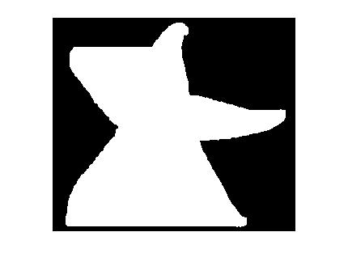

#### 1.1 other (maybe unused) implementations
   - myPerimeter: Handles bdd\_points, bdd\_length, Area, diameter for mySegmenter.
   - myDiameter: Handles diameter for myPerimeter.
   - myFill: Fills the blob so that it contains no holes.
   - myArea(unused): Takes the set of boundary points, and calulates the area by dividing it into triangles.
   - myPerimeterLength(unused):the sum of Euclidian distances between boundary points.

#### 1.2 myDT(imIn,method)
   - Creates the distance transfrom
   - Inputs : A 2-D logical or integer array, the image.
   - Outputs: [A,B]
    - A: the distance map outside the boundary
	- B: the distance map inside the boundary
   - implementation:
   By default, uses BFS to calculate the mannhattan distance to the closest boundary point. 
   If specified (method = '2-norm'), calculates distance from all pixels to each boundary point, then take min, vector programming, super fast.
   - Results
   - BFS
   - 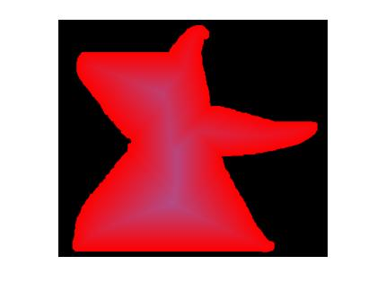
   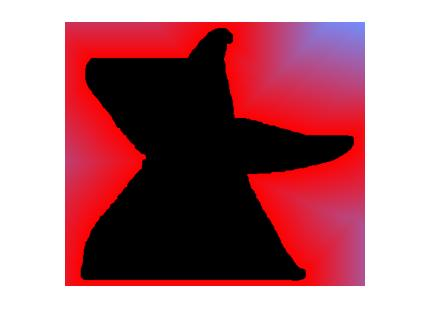
   - 2-norm
   - 
   

#### 1.3 Experiments
   - The predictor seems to grow with area/boundary length/diameter. Since the blobs are mostly circles, boundary length and diameter grow together, area is their square. So the predictor has the same behavior to the three measures.
   - Scatter plots:
   - x = Diameter, y = prepictor, correlation = 0.4818
   - 
   - x = Area, y = prepictor, correlation = 0.4646
   - 
   - x = Boundary length, y = prepictor, correlation = 0.4753
   - 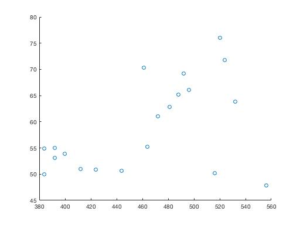

### Problem 2

#### 2.1 myRegionFinder(imIn)
   - Assign different values to different blobs.
   - Inputs : A 2-D logical or integer array, the image.
   - Outputs: A 2-D uint8 array
   - implementation: DFS to find connected components.
   - Results: imshow(imOut/double(imOut)/max(max(imOut))
   - 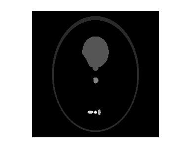
   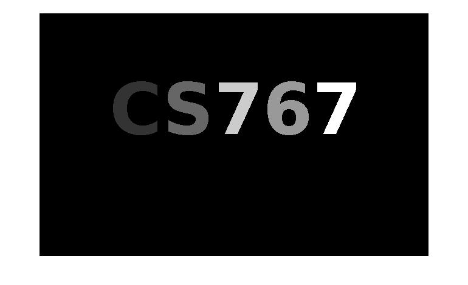

### Problem 3.1
   - myEdge(imIn,sigma): Based on Canny.
    1. Apply Gaussian filter
    2. Calculate gradient
    3. Filter out small gradients
    4. Non-maxium surpression
   - myEdge2(imIn,n):
    1. Quantize intensitys into n values.
    2. Calculate gradient
    3. Filter out small gradients
    4. Non-maxium surpression
   - Removing culttered edges: 
    1. Erosion
    2. edge(x,y) = 0, if edge(x,y) has less than 2 pixels in the 8-neighborhood are edge pixels.
   - Results
   - myEdge:
   - 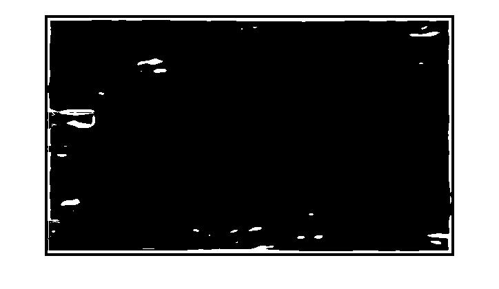
   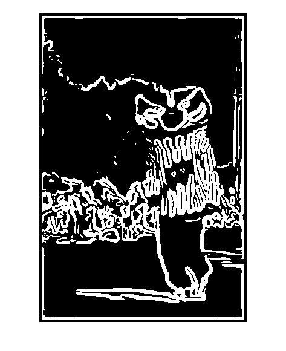
   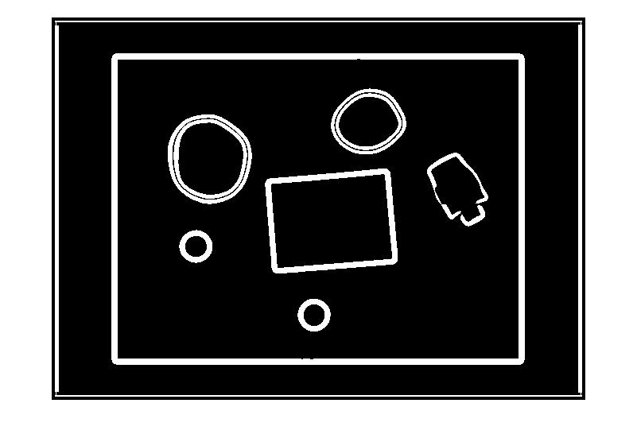
   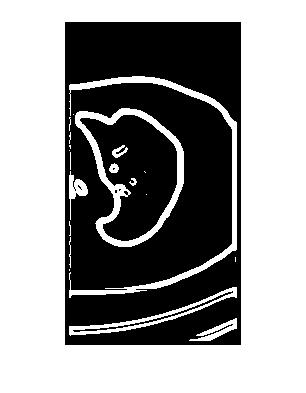
   - myEdge2:
   - 
   
   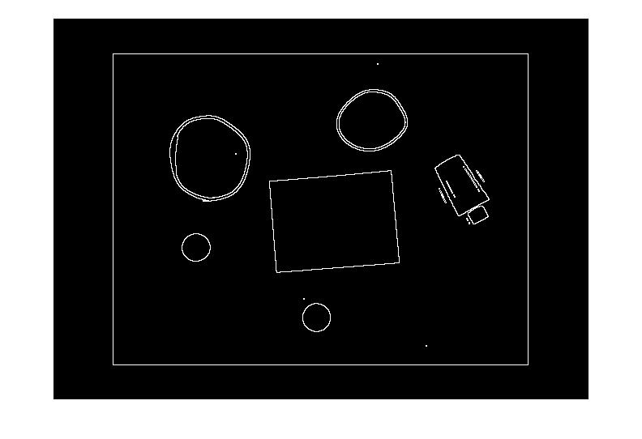
   

### Problem 3.2
   - groupEdge(imIn,x,y)
    Uses connected components method the group the edges. But allows a gap if 2 pixels between edges.
   - Cloud.png, (150,76)
   - 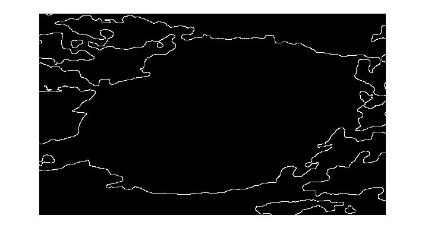
   - edge\_link.png, (150,76)
   - 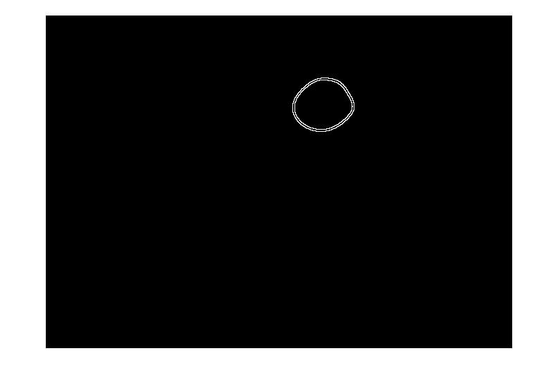
   - img\_ct\_lung, (100,88)
   - 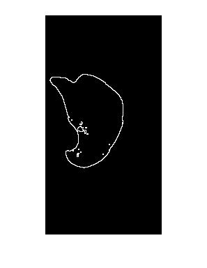
   - edge\_detecter, (400,197)
   - 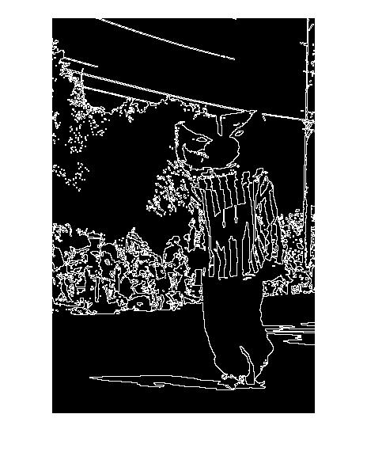
    

### Problem 4
   - IJCV 2001 Real-Time Face Detection
    - For getFeature, I didn't implement any concepts from the paper. Since directly summing all the pixels would be the fastest.
    - For getFeatureHist, I calculated the integral image first, then all the queries for getFeature(m,n,i,j) would be O(1) time.
   - getFeature
    - Regions that give no response are aproximately homogenious on the left and right.
    - Regions that have positive response have decresing intensity from left to right.
    - Regions that have negitive response have incresing intensity from left to right
   - getFeatureHist
